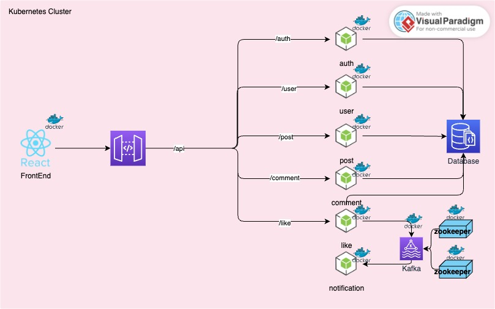

# TheSocialEdge Backend Repository

Welcome to the **TheSocialEdge Backend** repository! This project powers the server-side functionality of the **TheSocialEdge** social media platform, ensuring secure, scalable, and high-performing operations through a microservices architecture.

## Features
- **Authentication**: Secure user authentication using JWT.
- **Microservices Architecture**: Modular structure to enhance scalability and maintainability.
- **Database Integration**: MongoDB for efficient and flexible data storage.
- **Real-Time Communication**: Kafka for managing asynchronous and high-throughput data streaming.
- **Container Orchestration**: Kubernetes for auto-scaling, auto-healing, and efficient deployment.
- **RESTful APIs**: API endpoints for managing users, posts, comments, likes, and notifications.



## Table of Contents
1. [Getting Started](#getting-started)
2. [Technologies Used](#technologies-used)
3. [Microservices Overview](#microservices-overview)
4. [Development Workflow](#development-workflow)


## Getting Started

### Prerequisites
- [Node.js](https://nodejs.org/)
- [Docker](https://www.docker.com/)
- [Kafka](https://kafka.apache.org/)
- [Kubernetes](https://kubernetes.io/)

### Installation
1. Clone the repository:
   ```bash
   git clone https://github.com/MRPERFECT0603/TheSocialEdge-Backend-Microservices.git
   cd TheSocialEdge-Backend-Microservices
   ```
2. Install dependencies:
   ```bash
   npm install
   ```

3. Start the development server:
   ```bash
   npm run dev
   ```

The server will be running at [http://localhost:5000](http://localhost:5000).

## Technologies Used
- **Node.js**: JavaScript runtime for building scalable applications.
- **Express.js**: Lightweight web framework for building RESTful APIs.
- **MongoDB**: NoSQL database for managing application data.
- **Kafka**: Distributed message broker for real-time event processing.
- **Kubernetes**: Orchestrates the deployment and scaling of microservices.
- **Docker**: Containers for consistent development and deployment environments.
- **JWT**: Secure token-based user authentication.

## Microservices Overview
The backend is designed with a modular microservices architecture. Each service handles a specific domain:
- **AuthService**: User authentication and authorization.
- **UserService**: Managing user profiles and data.
- **PostService**: CRUD operations for posts.
- **LikeService**: Handling likes and reactions.
- **CommentService**: Managing comments on posts.
- **NotificationService**: Sending real-time notifications.

## Development Workflow
1. Ensure Docker and Kubernetes are installed and running.
2. Start the Kafka cluster for message brokering.
3. Deploy services using Kubernetes manifests.
